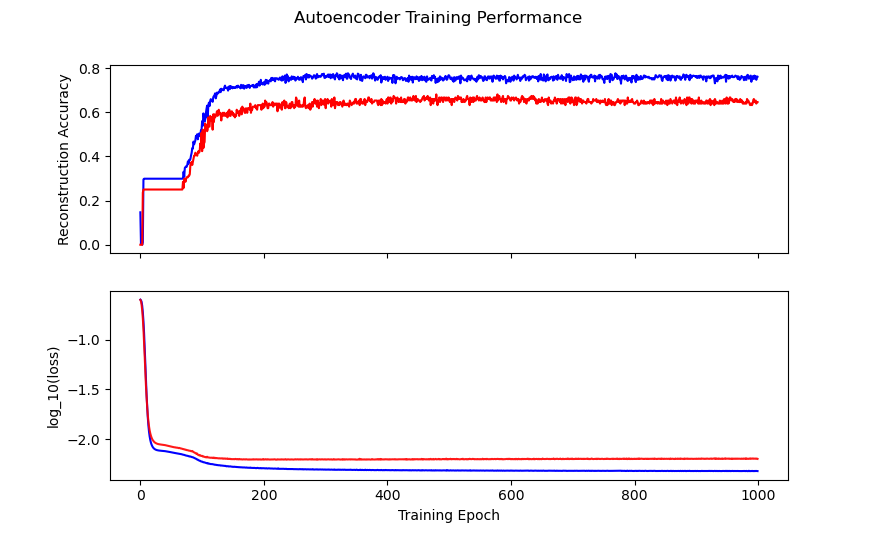

```{r setup-chunk, warning=FALSE, message=FALSE, include=FALSE}

```

Neural Networks are an immensely useful class of machine learning model, with countless applications. Today we are going to analyze a data set and see if we can gain new insights by applying unsupervised clustering techniques to find patterns and hidden groupings within the data. 

Our goal is to produce a dimension reduction on complicated data, so that we can create unsupervised, interpretable clusters like this:

```{r echo=F, fig.cap="Amazon cell phone data encoded in a 3 dimensional space, with K-means clustering defining eight clusters."}
knitr::include_graphics("img/kmeans_fig.gif")
```

## The Data

We will be looking at cell phones and customer reviews taken from Amazon during 2019. This data set is comprised of two files. The first file *items.csv* contains data on the individual products. It has columns containing: **Product ASIN, Product Brand, Product Title, Product URL, Product Image URL, Product Average Rating, Product Review Page URL, Product Total Reviews, Product Price, and Product Original Price**. The second file *reviews.csv* contains data on the individual reviews, which can be linked to the *items.csv* using the Product ASIN columns. The *reviews.csv* file has columns containing: **Product ASIN, Reviewer Name, Reviewer Rating (scale 1 to 5), Review Date, Valid Customer, Review Title, Review Content, and Helpful Feedbacks**. For brevity, we will focus only on the *items.csv* file, but you can imagine performing a very similar workflow on *reviews.csv*, which could then be used to analyze clusters of items against clusters of reviewers.

Thank you to [Griko Nibras](https://github.com/grikomsn), for curating this data and making it available on Kaggle! 

{}
**Where can you find the data yourself?** 

The data is available [HERE](https://www.kaggle.com/grikomsn/amazon-cell-phones-reviews) on Kaggle. 
{}

## The Software

Today we will be using Python 3.7.9, together with the machine learning package *TensorFlow*. We will use the *Keras* API, which makes building Neural Networks exceptionally straightforward. 


{}
Problems with **plot_model** 

Later we will use the function *plot_model* to visualize the neural networks. It can be problematic to get this function working on Windows 10 (at least at the time of writing this). You can skip running this function if you want, it saves an image of the neural network graph to disk, which can be useful for visualization but is otherwise unnecessary. If you encounter issues, here are the steps I took to get it working:

- use Python 3.7
- install [Graphviz](http://www.graphviz.org/)
- add graphviz to your system path, for me: **C:/Program Files (x86)/Graphviz 2.44.1/bin**
- install python packages *pydot* and *graphviz*
- add graphviz to the path in python: 

```{}
import os
os.environ["PATH"] += os.pathsep + 'C:/Program Files (x86)/Graphviz 2.44.1/bin' 
```

- restart your python IDE

After this *plot_model* worked for me, but if you can't get it working on Windows, I would suggest using Linux instead.
{}


## The Analysis

### Step 1: Load the libraries in Python

Load the following libraries (and install any that you are missing).

```{python eval=F, python.reticulate=F}
import numpy as np  # numpy for math
import pandas       # for dataframes and csv files
import matplotlib.pyplot as plt  # for plotting
from matplotlib import animation  # animate 3D plots
from mpl_toolkits.mplot3d import Axes3D  # 3D plots

# Scikit learn
from sklearn.model_selection import train_test_split
from sklearn.cluster import KMeans
from sklearn import manifold

# TensorFlow and Keras
import tensorflow as tf
from tensorflow.keras.layers.experimental import preprocessing
from tensorflow import keras
```

### Step 2: Load the Data in Python

Note that I have the data saved into the relative directory "./data/", you will need to modify the paths depending on where you have stored your data.

```{python eval=F, python.reticulate=F}
items_csv = pandas.read_csv("./data/items.csv")
items_csv.head(3) # look at top 3 items
items_csv.shape   # what is the size of the data?
```

```{}
>>> items_csv.head(3)
         asin     brand  ...  price originalPrice
0  B0000SX2UC       NaN  ...   0.00           0.0
1  B0009N5L7K  Motorola  ...  49.95           0.0
2  B000SKTZ0S  Motorola  ...  99.99           0.0
[3 rows x 10 columns]

items_csv.shape
(720, 10)
```

So you see that we have 720 rows of data, each containing 10 columns of information (as expected). We will do one more step before moving on: we will remove all rows with missing data. This is a controversial choice, since we could instead use imputation to fill missing values, or treat missing values informatively in the model. For simplicity, we will just drop all rows with missing data from the data set:

```{python eval=F, python.reticulate=F}
items_features = items_csv.copy().dropna()
```

### Step 3: Preprocess the Data

Our raw data needs to be transformed to work well with Keras, so we will need our data to be preprocessed. Some of our columns are numerical, and can be normalized, and some of them are strings (which will need special treatment). We will create a preprocessing layer for the model similar to [this tutorial](https://www.tensorflow.org/tutorials/load_data/csv#mixed_data_types), which will allow us to use each feature column appropriately.

First, we remove the columns which are not likely to be useful: **url, image, reviewUrl**, and **asin**: 

```{python eval=F, python.reticulate=F}
# Let's remove these columns as not interesting for us
items_features.pop("url")
items_features.pop("image")
items_features.pop("reviewUrl")
p_labels = items_features.pop("asin")
```

Now we will begin creating the preprocessing layer. We create a dictionary for our input features, with matching data types:

```{python eval=F, python.reticulate=F}
inputs = {}
for name, column in items_features.items():
    dtype = column.dtype
    if dtype == object:
        dtype = tf.string
    else:
        dtype = tf.float32
    inputs[name] = tf.keras.Input(shape=(1,), name=name, dtype=dtype)

inputs
```

```{}
>>> inputs
{'brand': <tf.Tensor 'brand_3:0' shape=(None, 1) dtype=string>, 
 'title': <tf.Tensor 'title_3:0' shape=(None, 1) dtype=string>, 
 'rating': <tf.Tensor 'rating_3:0' shape=(None, 1) dtype=float32>, 
 'totalReviews': <tf.Tensor 'totalReviews_3:0' shape=(None, 1) dtype=float32>, 
 'price': <tf.Tensor 'price_3:0' shape=(None, 1) dtype=float32>, 
 'originalPrice': <tf.Tensor 'originalPrice_3:0' shape=(None, 1) dtype=float32>}
```

You can see that *inputs* holds information about what the data looks like. We use this to tell Keras how to connect neural network layers together.

Next we separate out the four numerical columns, concatenate them into a single feature vector, and normalize:

```{python eval=F, python.reticulate=F}
# deal with numeric features
numeric_inputs = {name: input for name, input in inputs.items() if input.dtype == tf.float32}

x = tf.keras.layers.Concatenate()(list(numeric_inputs.values()))
norm = preprocessing.Normalization()
norm.adapt(np.array(items_features[numeric_inputs.keys()]))
all_numeric_inputs = norm(x)
preprocessed_inputs = [all_numeric_inputs]

all_numeric_inputs
```

```{}
>>> all_numeric_inputs
<tf.Tensor 'normalization/Identity:0' shape=(None, 4) dtype=float32>
```

Similarly, we process the string features (we create a vocabulary for each column, and encode them as [one-hot](https://en.wikipedia.org/wiki/One-hot)):


```{python eval=F, python.reticulate=F}
# deal with string features
for name, input in inputs.items():
    if input.dtype != tf.string:
        continue

    lookup = preprocessing.StringLookup(vocabulary=np.unique(items_features[name]))
    one_hot = preprocessing.CategoryEncoding(max_tokens=lookup.vocab_size())

    x = lookup(input)
    x = one_hot(x)
    preprocessed_inputs.append(x) # append preprocessed feature to features list
    
preprocessed_inputs
```

```{}
>>> preprocessed_inputs
[<tf.Tensor 'normalization/truediv:0' shape=(None, 4) dtype=float32>, 
 <tf.Tensor 'category_encoding_1/bincount/DenseBincount:0' shape=(None, 12) dtype=float32>, 
 <tf.Tensor 'category_encoding_2/bincount/DenseBincount:0' shape=(None, 716) dtype=float32>]
```

Finally, we concatenate the preprocessed inputs into a single vector, and create the processing model which we can later apply to our data as the first step in our neural network:

```{python eval=F, python.reticulate=F}
preprocessed_inputs_cat = keras.layers.Concatenate()(preprocessed_inputs)
preprocessing_layer = tf.keras.Model(inputs, preprocessed_inputs_cat, name="ProcessData")

# this saves an image of the model, see note regarding plot_model issues
tf.keras.utils.plot_model(model=preprocessing_layer, rankdir="LR", dpi=130, show_shapes=True, to_file="processing.png")
```

Here you can see the results of our processing model, starting with inputs for each of the columns of interest, and ending in a single feature vector:

```{r echo=F, fig.cap="Graph visualization of data preprocessing layers."}
knitr::include_graphics("img/processing.png")
```


Let's apply the layer to two rows of data, to see the preprocessing layer in action:

```{python eval=F, python.reticulate=F}
items_features_dict = {name: np.array(value) for name, value in items_features.items()}

# grab two samples
two_sample_dict = {name:values[1:3, ] for name, values in items_features_dict.items()}
two_sample_dict
```

```{}
>>> two_sample_dict
{'brand': array(['Motorola', 'Motorola'], dtype=object), 
 'title': array(['MOTOROLA C168i AT&T CINGULAR PREPAID GOPHONE CELL PHONE', 'Motorola i335 Cell Phone Boost Mobile'], dtype=object), 
 'rating': array([2.7, 3.3]), 
 'totalReviews': array([22, 21], dtype=int64), 
 'price': array([99.99,  0.  ]), 
 'originalPrice': array([0., 0.])}
```

```{python eval=F, python.reticulate=F}
# apply the preprocessing layer
two_sample_fitted = preprocessing_layer(two_sample_dict)

two_sample_fitted
```

```{}
>>> two_sample_fitted
<tf.Tensor: shape=(2, 732), dtype=float32, numpy=
array([[-1.4144895 , -0.50023943, -0.67571497, ...,  0.        ,
         0.        ,  0.        ],
       [-0.57760113, -0.50619656, -1.1760992 , ...,  0.        ,
         0.        ,  0.        ]], dtype=float32)>
```

Great! We can now process our input data into useful Tensors. Now we can move on to trying to find natural clusters in the data.

### Step 4: Autoencoders for Dimension Reduction

Our model now has a preprocessing layer, which prepares the raw data for use. However, a single row of data (after processing) is represented by a whopping 732 features. We need to reduce the dimensionality of the data into something a little less unwieldy. To accomplish this task, we will use a simple [autoencoder](https://en.wikipedia.org/wiki/Autoencoder). You can read more on how to implement various types of autoencoders at the [keras blog](https://blog.keras.io/building-autoencoders-in-keras.html).

Here is the autoencoder portion of the model:

```{python eval=F, python.reticulate=F}
# This is the size of our input data
full_dim = two_sample_fitted.shape.as_list()[1]

# these are the downsampling/upsampling dimensions
encoding_dim1 = 128
encoding_dim2 = 16
encoding_dim3 = 3 # we will use these 3 dimensions for clustering

# This is our encoder input
encoder_input_data = keras.Input(shape=(full_dim,))

# the encoded representation of the input
encoded_layer1 = keras.layers.Dense(encoding_dim1, activation='relu')(encoder_input_data)
encoded_layer2 = keras.layers.Dense(encoding_dim2, activation='relu')(encoded_layer1)
# Note that encoded_layer3 is our 3 dimensional "clustered" layer, which we will later use for clustering
encoded_layer3 = keras.layers.Dense(encoding_dim3, activation='relu', name="ClusteringLayer")(encoded_layer2)

encoder_model = keras.Model(encoder_input_data, encoded_layer3)

# the reconstruction of the input
decoded_layer3 = keras.layers.Dense(encoding_dim2, activation='relu')(encoded_layer3)
decoded_layer2 = keras.layers.Dense(encoding_dim1, activation='relu')(decoded_layer3)
decoded_layer1 = keras.layers.Dense(full_dim, activation='sigmoid')(decoded_layer2)

# This model maps an input to its autoencoder reconstruction
autoencoder_model = keras.Model(encoder_input_data, outputs=decoded_layer1, name="Encoder")

# compile the model
autoencoder_model.compile(optimizer="RMSprop", loss=tf.keras.losses.mean_squared_error)
tf.keras.utils.plot_model(model=autoencoder_model, rankdir="LR", dpi=130, show_shapes=True, to_file="autoencoder.png")
```

The autoencoder layer of the model looks like this:

```{r echo=F, fig.cap="Graph visualization of autoencoder layers."}
knitr::include_graphics("img/autoencoder.png")
```


### Step 5: Training the Model

Now, we need to train the model; currently our model does nothing! All of the model weights are randomized, and not particularly useful.

```{python eval=F, python.reticulate=F}
# process the inputs
p_items = preprocessing_layer(items_features_dict)

# split into training and testing sets (80/20 split)
train_data, test_data, train_labels, test_labels = train_test_split(p_items.numpy(), p_labels, train_size=0.8, random_state=5)

# fit the model using the training data
history = autoencoder_model.fit(train_data, train_data, epochs=1000, batch_size=256, shuffle=True, validation_data=(test_data, test_data))
```

Let's have a look at the training progress:

```{python eval=F, python.reticulate=F}
# Investigate training performance:
history_fig, (ax1, ax2) = plt.subplots(2, sharex=True)
history_fig.suptitle('Autoencoder Training Performance')
ax1.plot(range(0,1000), history.history['accuracy'], color='blue')
ax1.set(ylabel='Reconstruction Accuracy')
ax2.plot(range(0,1000), np.log10(history.history['loss']), color='blue')
ax2.plot(range(0,1000), np.log10(history.history['val_loss']), color='red', alpha=0.9)
ax2.set(ylabel='log_10(loss)', xlabel='Training Epoch')
history_fig
```

```{r echo=F, fig.cap="Autoencoder model training history. Training is in blue, validation is in red."}

```

You can see that we get decent reconstruction from the autoencoder (76\% training accuracy, 65\% validation accuracy). This is far from perfect reconstruction, and more work could be done to improve the autoencoder (for example, feature specific encoding, larger encoding dimensions, etc). For our purposes, this is good enough.

So, we now have an encoder which can produce a 3 dimensional representation of our 732 dimensional data. Here is what that looks like:

```{r echo=F, fig.cap="Amazon cell phone data encoded in a 3 dimensional space. [See this blog for details on animating your 3D plots](http://blog.mahler83.net/2019/10/rotating-3d-t-sne-animated-gif-scatterplot-with-matplotlib/)."}
knitr::include_graphics("img/encoder_fig.gif")
```

At this point, you might be wondering: **"Why would I ever want to do this? These are arbitrary points in 3D space, how can I interpret this encoding?"**. Good questions. Let's suppose that you want to know how a products rating impacts its encoding:


```{r echo=F, fig.cap="How does average user rating impact the encoding?"}
knitr::include_graphics("img/rating_fig.gif")
```

I hope you will agree that this is surprisingly easy to interpret, with ratings smeared from high to low in a predictable manner. You can make similar plots to visualize the impact of the other features on encoding.

### Step 6: Clustering

After all of this preparation, we are finally ready to try clustering the data. There are a vast number of methods for clustering. We will use [K-means](https://en.wikipedia.org/wiki/K-means_clustering) as one of the simplest clustering methods. We aren't just clustering the raw data, we are using the autoencoder representation of the data so as to reduce the dimensionality of the problem from 732 dimensions all the way down to 3 dimensions.

First step, we need to decide how many clusters to use! We will use the elbow method, as in [this K-means tutorial](https://blog.cambridgespark.com/how-to-determine-the-optimal-number-of-clusters-for-k-means-clustering-14f27070048f):

```{python eval=F, python.reticulate=F}
encoded_items = encoder_model(p_items)

# choose number of clusters K:
Sum_of_squared_distances = []
K = range(1,30)
for k in K:
    km = KMeans(init='k-means++', n_clusters=k, n_init=10)
    km.fit(encoded_items)
    Sum_of_squared_distances.append(km.inertia_)

plt.plot(K, Sum_of_squared_distances, 'bx-')
plt.vlines(ymin=0, ymax=150000, x=8, colors='red')
plt.text(x=8.2, y=130000, s="optimal K=8")
plt.xlabel('Number of Clusters K')
plt.ylabel('Sum of squared distances')
plt.title('Elbow Method For Optimal K')
plt.show()
```


```{r echo=F, fig.cap="Elbow plot for choosing optimal K in K-means."}
knitr::include_graphics("img/elbow_plot.png")
```

From the elbow plot, it looks like K between 5 and 10 would be appropriate. Let's go with K=8 as our optimal choice.

Here we fit the K-means using 8 clusters:

```{python eval=F, python.reticulate=F}
kmeans = KMeans(init='k-means++', n_clusters=8, n_init=10)
kmeans.fit(encoded_items)
P = kmeans.predict(encoded_items)
```

And we can visualize the clusters easily in our 3 dimensional representation:

```{python eval=F, python.reticulate=F}
# visualize the clusters:
encoded_fig = plt.figure()
ax = Axes3D(encoded_fig)
p = ax.scatter(encoded_items[:,0], encoded_items[:,1], encoded_items[:,2], c=P, marker="o", picker=True, cmap="rainbow")
plt.colorbar(p, shrink=0.5)
plt.show()

angle = 3
ani = animation.FuncAnimation(encoded_fig, rotate, frames=np.arange(0, 360, angle), interval=50)
ani.save('kmeans_fig.gif', writer=animation.PillowWriter(fps=12))
```


```{r echo=F, fig.cap="Amazon cell phone data encoded in a 3 dimensional space, with K-means clustering defining eight clusters."}
knitr::include_graphics("img/kmeans_fig.gif")
```

The clustering looks mostly reasonable, however there is clearly some bleeding between clusters, and the visually clear crescent shaped clusters are not crisply identified by the K-means. A more sophisticated clustering algorithm should probably be used on this. [Density based clustering](https://en.wikipedia.org/wiki/Cluster_analysis#Density-based_clustering) would be my next bet!

## Conclusions

We have barely scratched the surface for what can be done with this data set, and there are a great many different techniques for performing clustering (both supervised and unsupervised). Additional work can be done analyzing the clusters themselves for interpretability (for example, cluster based histograms of brand, rating, price, etc.). I hope that this walk through has given you some insight into how you can apply these ideas to your own data! 


